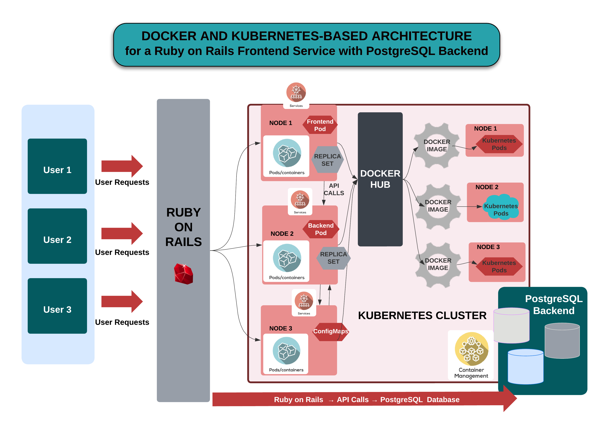

# Scalable Microservices Deployment with Kubernetes

## Overview
This project demonstrates the deployment of a scalable and reliable full-stack web application on a Kubernetes cluster. The application consists of a Ruby on Rails backend and a PostgreSQL database, each deployed as separate microservices to enhance scalability and maintainability. ConfigMaps are used for efficient configuration management.

For more detailed information about the project, please visit the [project website](http://scalablemicroservicesdeploymentwithkubernetes.s3-website.us-east-2.amazonaws.com/index.html).


<div align="center">
  
</div>


## Features
- **Microservices Architecture**: Frontend and backend components are deployed as independent microservices, allowing for granular scalability and flexibility.
- **Kubernetes**: Orchestrates the deployment, scaling, and management of the microservices, ensuring high availability and efficient resource utilization.
- **Docker**: Containerizes the application components, providing consistency across different environments and simplifying the deployment process.
- **PostgreSQL**: A robust and scalable relational database that stores and manages application data reliably.
- **ConfigMaps**: Manages environment variables and configurations for the distributed microservices, enabling centralized and dynamic configuration updates.


## Technologies
- Docker
- Kubernetes


## Project Description
In this project, I used Docker and Kubernetes command-line tools to deploy a Ruby on Rails (RoR) application over a Kubernetes cluster. The application uses a PostgreSQL database. Kubernetes handles the deployment, management, and scaling of the services, while Docker is used for containerization. Environment variables are managed using ConfigMaps.


## Prerequisites
- Docker
- Kubernetes
- kubectl (Kubernetes command-line tool)
- An active Docker Hub account
- Basic knowledge of Docker and Kubernetes


## Setup Instructions

1. **Clone the Repository**:
    ```bash
    git clone <repository-url>
    cd <repository-directory>
    ```

2. **Build Docker Images**:
    - Navigate to the directory containing the Dockerfile for the frontend and backend.
    - Build the Docker images:
    ```bash
    docker build -t <your-dockerhub-username>/frontend .
    docker build -t <your-dockerhub-username>/backend .
    ```

3. **Push Docker Images to Docker Hub**:
    ```bash
    docker push <your-dockerhub-username>/frontend
    docker push <your-dockerhub-username>/backend
    ```

## Deployment Instructions

1. **Create a Kubernetes Cluster**:
    - You can use Minikube, kind, or a cloud provider's Kubernetes service (e.g., GKE, EKS, AKS).

2. **Deploy the Database**:
    ```bash
    kubectl apply -f k8s/database-deployment.yaml
    kubectl apply -f k8s/database-service.yaml
    ```

3. **Deploy the Frontend**:
    ```bash
    kubectl apply -f k8s/frontend-deployment.yaml
    kubectl apply -f k8s/frontend-service.yaml
    ```

4. **Create a ConfigMap**:
    ```bash
    kubectl apply -f k8s/configmap.yaml
    ```

5. **Configure Deployments with ConfigMap**:
    - Ensure that your deployments are using the environment variables defined in the ConfigMap.

6. **Access the Application**:
    - Use `kubectl get services` to find the external IP address of your frontend service and access it via a browser.

## Usage
- Once the application is deployed, navigate to the frontend service's external IP to use the application.

## Troubleshooting
- **Common Issues**:
    - Ensure all Kubernetes pods are running: `kubectl get pods`.
    - Check logs for any errors: `kubectl logs <pod-name>`.
    - Verify Docker images are correctly pushed to Docker Hub and accessible.
    - Ensure environment variables in ConfigMap are correctly referenced in deployments.

## Conclusion
By following these instructions, you should be able to deploy a scalable and reliable web application using microservices architecture over a Kubernetes cluster. The use of Docker for containerization and Kubernetes for orchestration demonstrates best practices in modern application deployment.
